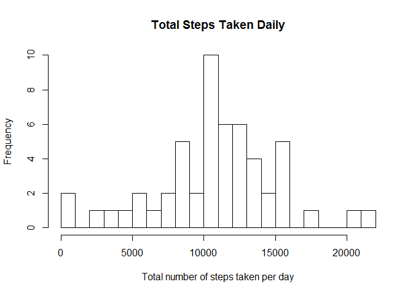
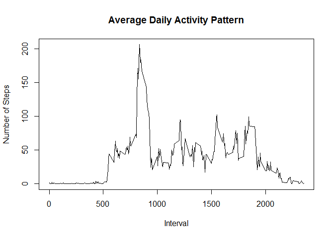
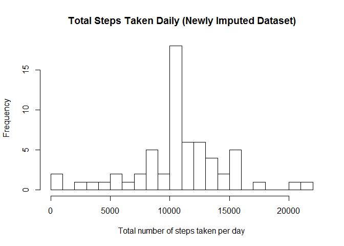
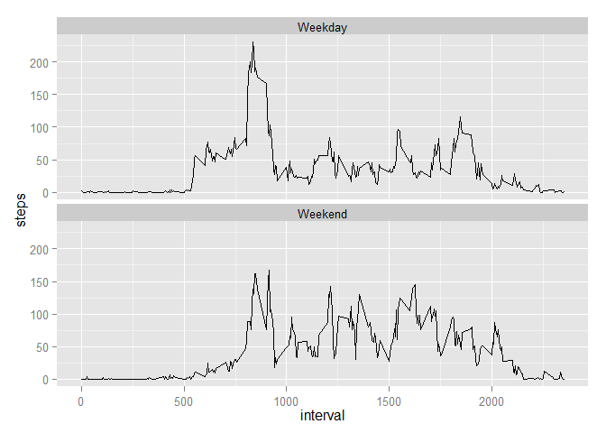

# Reproducible Research: Peer Assessment 1


### Introduction
It is now possible to collect a large amount of data about personal movement using activity monitoring devices such as a Fitbit, Nike Fuelband, or Jawbone Up. These type of devices are part of the "quantified self" movement - a group of enthusiasts who take measurements about themselves regularly to improve their health, to find patterns in their behavior, or because they are tech geeks. But these data remain under-utilized both because the raw data are hard to obtain and there is a lack of statistical methods and software for processing and interpreting the data.

This assignment makes use of data from a personal activity monitoring device. This device collects data at 5 minute intervals through out the day. The data consists of two months of data from an anonymous individual collected during the months of October and November, 2012 and include the number of steps taken in 5 minute intervals each day.  
<br><br>


## Loading and preprocessing the data
**1. Load the data (i.e. read.csv())**

**2. Process/transform the data (if necessary) into a format suitable for your analysis**

```r
library(ggplot2)
data <- read.csv(unzip('activity.zip'))
```
<br><br>
  

## What is mean total number of steps taken per day?
**1. Make a histogram of the total number of steps taken each day**

```r
steps_taken_daily <- aggregate(steps ~ date, data, sum)$steps
hist(steps_taken_daily, breaks = 20, xlab = "Total number of steps taken per day", main = "Total Steps Taken Daily")
```

 

**2. Calculate and report the mean and median total number of steps taken per day**

```r
mean(steps_taken_daily)
```

```
## [1] 10766.19
```

```r
median(steps_taken_daily)
```

```
## [1] 10765
```
<br><br>
  

## What is the average daily activity pattern?
**1. Make a time series plot (i.e. type = "l") of the 5-minute interval (x-axis) and the average number of steps taken, averaged across all days (y-axis)**

```r
daily_steps_pattern <- aggregate(steps ~ interval, data, mean)
plot(daily_steps_pattern$interval, daily_steps_pattern$steps, type = "l", main="Average Daily Activity Pattern", ylab="Number of Steps", xlab="Interval")
```

 

**2. Which 5-minute interval, on average across all the days in the dataset, contains the maximum number of steps?**

```r
daily_steps_pattern$interval[which.max(daily_steps_pattern$steps)]
```

```
## [1] 835
```
<br><br>
  

## Imputing missing values
**1. Calculate and report the total number of missing values in the dataset (i.e. the total number of rows with NAs)**

```r
sum(is.na(data))
```

```
## [1] 2304
```

**2. Devise a strategy for filling in all of the missing values in the dataset. The strategy does not need to be sophisticated. For example, you could use the mean/median for that day, or the mean for that 5-minute interval, etc.**

I have decided to use the mean for the respective 5-minute intervals to populate all missing values in the dataset.

**3. Create a new dataset that is equal to the original dataset but with the missing data filled in.**

```r
new_data <- data
new_data$steps[is.na(new_data$steps)] <- daily_steps_pattern$steps
```
Reconfirm if new data has no "NAs""

```r
sum(is.na(new_data))
```

```
## [1] 0
```

**4. Make a histogram of the total number of steps taken each day and Calculate and report the mean and median total number of steps taken per day. Do these values differ from the estimates from the first part of the assignment? What is the impact of imputing missing data on the estimates of the total daily number of steps?**
Make historgram of total number of steps taken each day

```r
steps_taken_daily_new <- aggregate(steps ~ date, new_data, sum)$steps
hist(steps_taken_daily_new, breaks = 20, xlab = "Total number of steps taken per day", main = "Total Steps Taken Daily (Newly Imputed Dataset)")
```

 

Calculate and report the mean and median total number of steps taken per day

```r
mean(steps_taken_daily_new)
```

```
## [1] 10766.19
```

```r
median(steps_taken_daily_new)
```

```
## [1] 10766.19
```
**Do these values differ from the estimates from the first part of the assignment? What is the impact of imputing missing data on the estimates of the total daily number of steps?**

Only a slight change in median is seen within the newly imputed dataset. 
It does seem like the impact of imputing missing data is very minimal, specifically in the case of estimating total daily steps.
<br><br>
  

## Are there differences in activity patterns between weekdays and weekends?
**1. Create a new factor variable in the dataset with two levels - "weekday" and "weekend" indicating whether a given date is a weekday or weekend day.**

```r
new_data$day <- ifelse(weekdays(as.Date(new_data$date)) %in% c("Saturday", "Sunday"),"Weekend", "Weekday")
new_data$day <- as.factor(new_data$day)
```
**2. Make a panel plot containing a time series plot (i.e. type = "l") of the 5-minute interval (x-axis) and the average number of steps taken, averaged across all weekday days or weekend days (y-axis). See the README file in the GitHub repository to see an example of what this plot should look like using simulated data.**

```r
steps_day <- aggregate(steps ~ interval + day, new_data, mean)
ggplot(steps_day, aes(x=interval, y=steps, group=1)) + facet_wrap(~ day, ncol=1) + geom_line()
```

 
